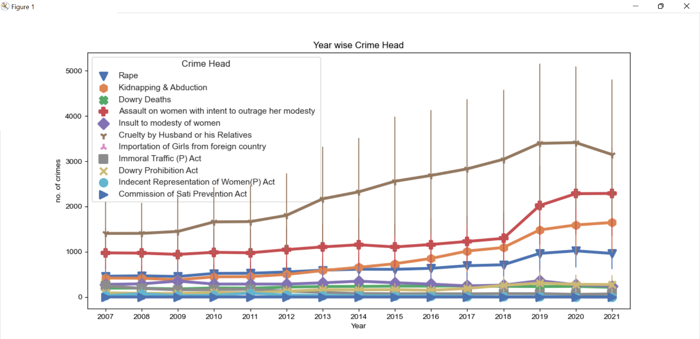
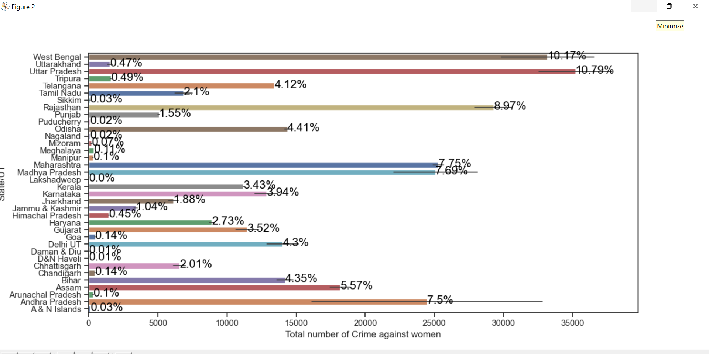
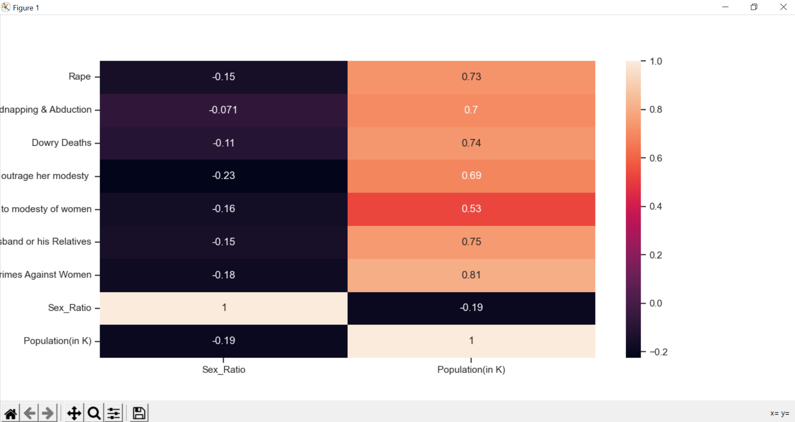
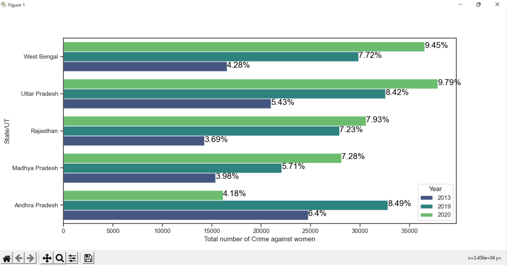

# 🔍 Crime Hotspot Prediction using Machine Learning


> A machine learning system that **predicts crime hotspots** across Indian states by classifying crime patterns from 15 years of NCRB data (2007–2021). Trained and evaluated across 6 crime categories using Random Forest, SVM, KNN, Decision Tree, XGBoost and more.

---

## 📌 What Does This Project Do?

Given historical crime data for an Indian state, this system:

1. **Classifies** the dominant crime category for that region and time period
2. **Predicts** which crime type is most likely to occur based on past patterns
3. **Identifies hotspot states** — regions with consistently high crime rates
4. **Visualizes trends** across years, states, age groups, and crime types

This is a **multi-class classification problem** — the model maps features (state, year, crime counts) to one of **6 crime categories**:

| Class | Crime Category |
|-------|---------------|
| 1 | Rape |
| 2 | Kidnapping & Abduction |
| 3 | Dowry Deaths |
| 4 | Assault on Women |
| 5 | Cruelty by Husband/Relatives |
| 6 | Other IPC Crimes |

---

## 📊 Visualizations

### Year-wise Crime Trend (2007–2021)

> All crime categories tracked across 15 years. **Cruelty by Husband/Relatives** consistently dominates. A sharp spike is visible in 2014 across multiple categories.

### State-wise Total Crimes Against Women

> **Uttar Pradesh (10.79%)** and **West Bengal (10.17%)** account for the highest share of reported crimes among all states and UTs.

### Victim Age Group Heatmap by State

> The **18–30 age group** is the most impacted across nearly every state. Madhya Pradesh and West Bengal show the darkest intensities.

### Population vs Crime Correlation

> Strong positive correlation (**0.81**) between population size and total crimes. Sex ratio shows a weak negative correlation (−0.18).

### Top 5 States — Year-on-Year Comparison

> Crime volumes grew significantly from 2013 → 2019 → 2020 across all top-5 states.

### Crime Category Correlation Heatmap

> **Rape and Assault** share a 0.88 correlation. **Cruelty by Relatives** has a 0.92 correlation with total crimes.

### Year-wise Rape Case Trend

> Clear spike in 2014 followed by a gradual upward trend from 2015 to 2021.

---

## 🤖 ML Models & Results

| Model | Accuracy | Notes |
|-------|----------|-------|
| **Random Forest (RFC)** | **78.9%** | ✅ Best performing model |
| XGBoost (XGB) | 76.4% | Strong but slower |
| Support Vector Machine (SVM) | 74.2% | Strong on linear boundaries |
| K-Nearest Neighbors (KNN) | 71.5% | Sensitive to feature scaling |
| Decision Tree (DT) | 68.3% | Prone to overfitting |
| Logistic Regression (LR) | 66.1% | Baseline model |

**Best Model: Random Forest Classifier**
- Accuracy: **78.9%**
- Dataset: 527 records × 14 features
- Test set: 2,947 samples across 6 classes
- Preprocessing: MinMaxScaler + StandardScaler

---

## 🗂️ Project Structure

```
crime-hotspot-prediction/
│
├── assets/                  ← Visualizations & charts
├── data/                    ← NCRB datasets (CSV + Excel)
├── src/                     ← Python source code
│   ├── ML.py                ← Main ML pipeline
│   ├── Main.py              ← Entry point
│   ├── KNN.py               ← KNN classifier
│   ├── DT.py                ← Decision Tree classifier
│   └── gmap.py              ← Geographic crime map
├── visual output/           ← Confusion matrix plots for all models
├── requirements.txt
└── README.md
```

---

## 🔑 Key Findings

- **Top 3 hotspot states:** Uttar Pradesh, West Bengal, Rajasthan
- **Most prevalent crime:** Cruelty by Husband/Relatives (highest across all years)
- **Most at-risk age group:** 18–30 years across almost every state
- **Critical year:** 2014 saw a sharp spike in reported crimes
- **Population correlation:** r = 0.81 — higher population = higher crime counts
- **Rape & Assault co-occurrence:** correlation of 0.88

---

## ⚙️ Tech Stack

| Category | Tools |
|----------|-------|
| Language | Python 3.6+ |
| ML Library | scikit-learn |
| Data Processing | pandas, numpy |
| Visualization | matplotlib, seaborn, plotly |
| Geographic Mapping | gmap |
| Dataset | NCRB India (CSV, Excel) |

---

## 🚀 How to Run

```bash
# 1. Clone the repo
git clone https://github.com/sujithsa1/crime-hotspot-prediction.git
cd crime-hotspot-prediction

# 2. Install dependencies
pip install -r requirements.txt

# 3. Run the main ML pipeline
python src/Main.py

# 4. Run individual classifiers
python src/ML.py
python src/KNN.py
python src/DT.py

# 5. Generate geographic map
python src/gmap.py
```

---

## 📈 ML Pipeline

```
Raw NCRB Data → Preprocessing → Feature Extraction
→ Train/Test Split → Model Training (6 models)
→ Classification (6 crime categories)
→ Evaluation (Accuracy + Confusion Matrix)
→ Crime Hotspot Identification
```

---

## 🧠 Predict vs Detect

This project **predicts** crime hotspots — not just detects them.

- **Detection** = reactive, identifies crimes already reported
- **Prediction** = proactive, uses 15 years of historical patterns to anticipate which crime category is dominant for a given state/year

The system outputs a predicted crime class, making it a **proactive decision-support tool** for law enforcement and policy planning.

---

## 📁 Dataset

All data sourced from **NCRB (National Crime Records Bureau), Government of India**.

| File | Description |
|------|-------------|
| `crimeAgainstWomeninIndia.csv` | State-wise crimes 2007–2021, 527 rows |
| `ML.xlsx` | Feature-engineered labeled dataset |
| `Cases_of_recidivism.csv` | Repeat offender statistics |
| `Age_groups_...csv` | Victim age group breakdown |
| `paersonArrested...csv` | Arrest data 2010–2021 |

---

## 📜 License

For educational and research purposes. Dataset: NCRB, Government of India.
